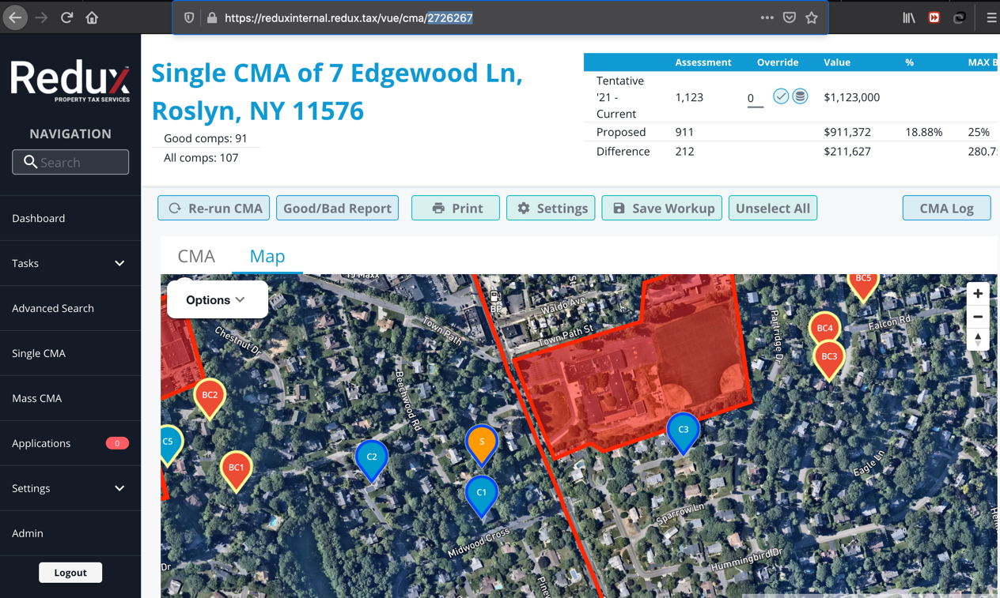
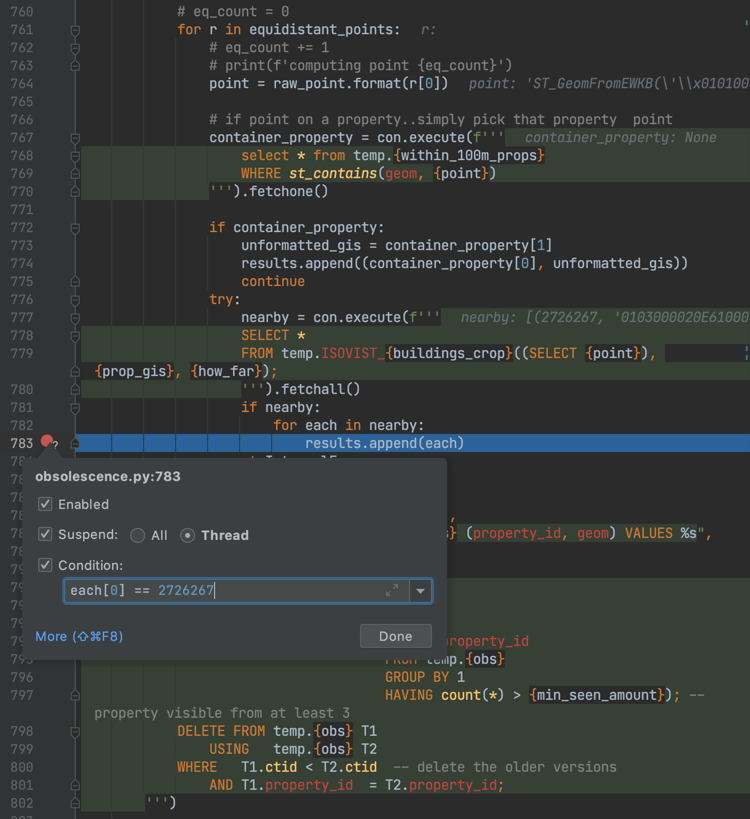
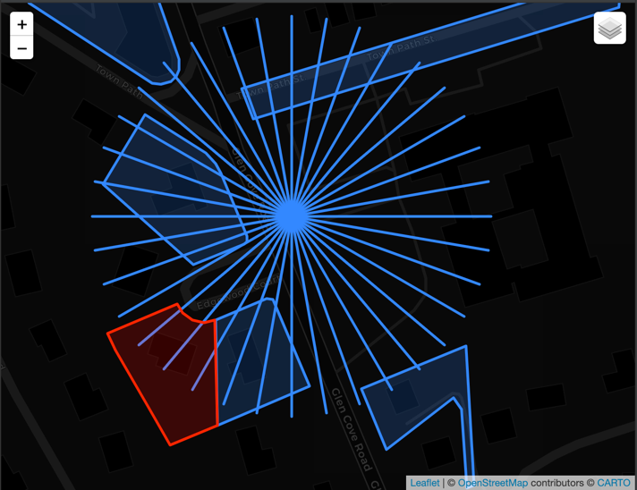

This documentation describes steps to find why certain subject is affected by a building obsolescence.

Let us take as an example property with id 2726267 from our database. It has an apn of '07231 00180'.



As you can see from the screenshot subject property is affected by both road and a building obsolescence. Here we will
talk only about the building obsolescence.

Firstly let's get id of obsolescence itself.

```postgresql
SELECT obs_id
FROM obsolescences
WHERE affected_property_id = 2726267
```

Query returns 4634886.

Next we focus on finding point whose rays hit subject building. Remember we distribute equidistant points along
obsolescence building perimeter, then we iterate through each point and collect buildings hit by at least three of these
perimeter points.

Set conditional breakpoint on line 783


Run debugger with this config

```bash
$ flask obsolescence compute_single 4634886
```

Please refer to document RAY_TRACING_ROAD.md for instructions on how to achieve this with python's pdb debugger.

After you hit the breakpoint you got all necessary information.

Copy compiled string between lines 541 and 663 plus string between 778 and 780 into postgres console. Do not run it yet
because we gonna add couple of lines of code in there.

You should have something looking like in the sample file building_sample.sql

Lines we inserted are below

```postgresql
SELECT b.p_id, b.geom
FROM isovist_buildings b
```

which are

```postgresql
UNION
SELECT *
FROM rays
```

Run the sql script and in geo viewer you should see rays hitting red polygon which is our subject property.

