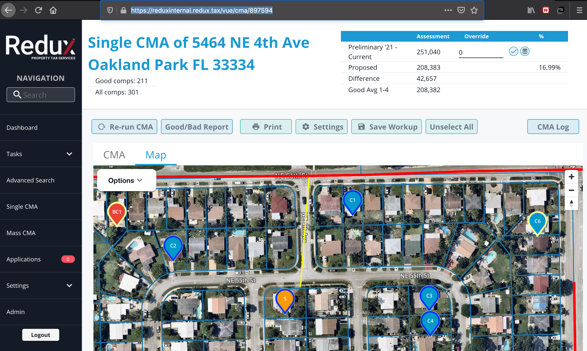
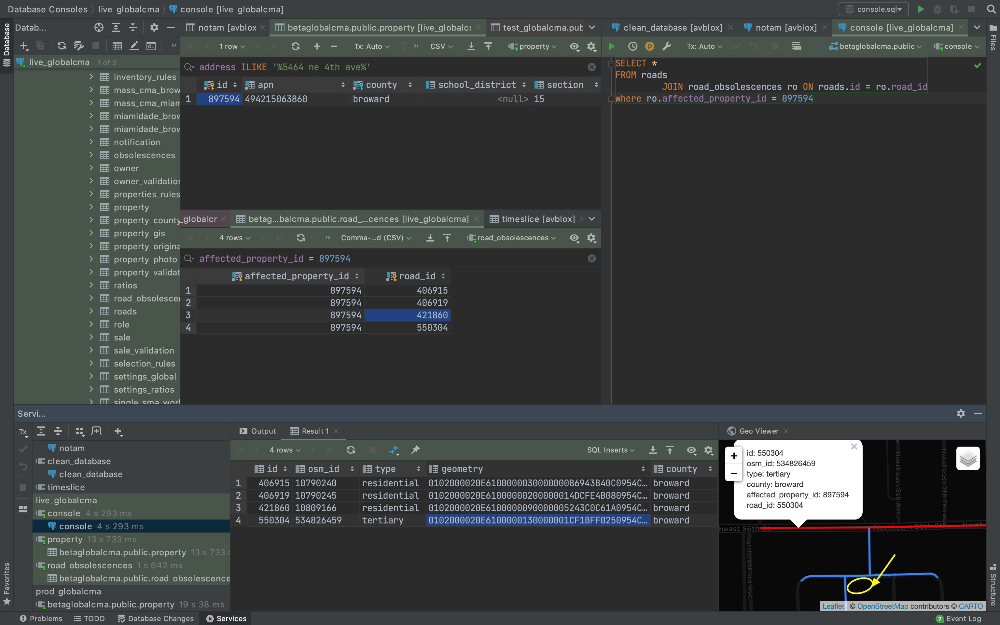
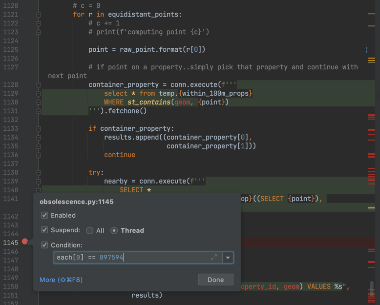
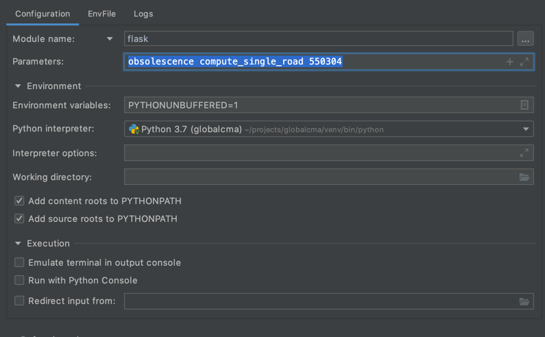
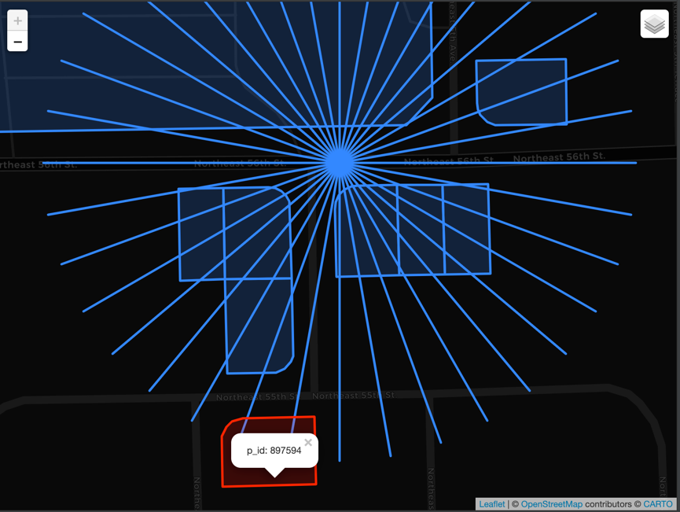

This document describes how to debug properties affected by the road obsolescence. You fill find answer why a certain
property is affected by a road obsolescence.

Let's debug the case of subject having apn '494215063860' which identified with 897594 in our database.

Please navigate to https://reduxinternal.redux.tax/vue/cma/897594
to get the picture of subject and road obsolescence.



We may assume now that subject is affected because there exists a yellow ray shining from the road to the subject as you
can see on the screenshot above.

First of all, let's get the road id of interest. To help get things done I use DataGrip IDE from JetBrains. Feel free to
use any other IDE with Geo viewer available.



```postgresql
SELECT *
FROM roads
         JOIN road_obsolescences ro ON roads.id = ro.road_id
WHERE ro.affected_property_id = 897594
```

Query returns all the roads our subject property is affected by. From there we find the id of road of interest to be 550304. Notice yellow circle on the geo viewer. That is our subject property.

Next let's get any of the point located on the road whose rays hit the subject. Remember we place equidistant points on
the road 5 meters apart and we consider building affected by the road if at least three points have their rays hitting
that building.

Please navigate to
`
../appflask/app/blueprints/obsolescence.py
`

and place a conditional breakpoint on line 1145. In PyCharm IDE it looks like on the screenshot below.



Create new run configuration with the following options



Press debug with this configuration and wait till you hit the endpoint.

As an alternative you may use pdb debugger. Add

```python
if each[0] == 897594:
    import pdb
    pdb.set_trace()
```

to line 1145 and then run

```bash
$ flask obsolescence compute_single_road 550304
```

in your terminal.

After you hit the breakpoint copy the return of print statement of a string argument of conn.execute() located between lines 940 and 1059. Note do not just copy and paste sql you see in IDE but supply it as argument into print function first to expand dynamic parameters. `pyperclip.copy()` may be very handy in this case.

Do the same for string between lines 1140 and 1142.

Refer to road_sample.sql as an example of output you should get. Important piece of code you need to add below

```postgresql
SELECT b.p_id, b.geom
FROM isovist_buildings b
```

is

```postgresql
UNION
SELECT *
FROM rays;
```

Run the sql script and you will get the desired picture in geo viewer. Red square is the subject property. 

